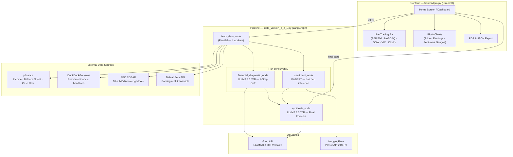
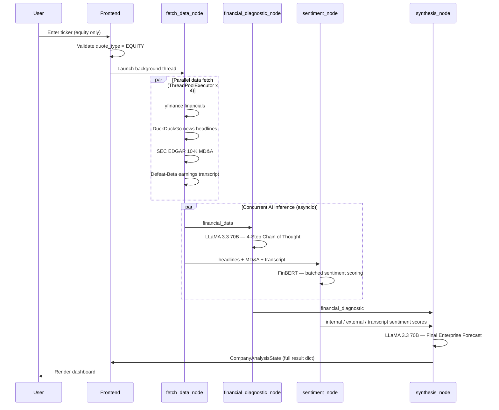
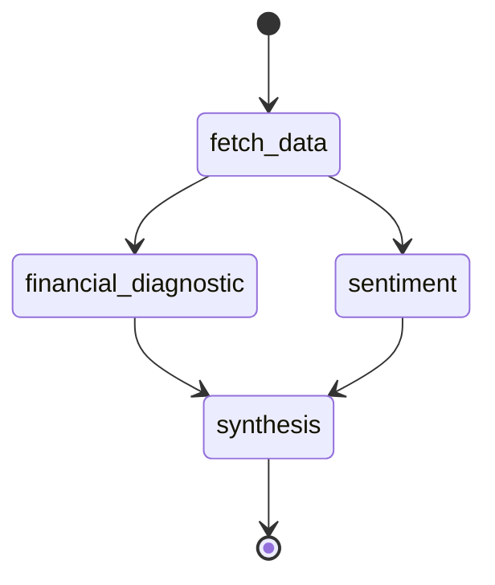

# Analyst in a Box

Institutional-grade equity research generated in seconds using AI and NLP.

Built at Columbia University.

---

## Overview

Analyst in a Box is a full-stack financial research platform that ingests data from four primary sources — SEC EDGAR filings, earnings call transcripts, financial news, and market data — and synthesizes them into a structured equity forecast using a two-model AI pipeline (FinBERT + LLaMA 3.3 70B).

The system is designed around the same analytical framework used by institutional equity research desks: quantitative baseline → NLP sentiment scoring → synthesis with explicit citation of hard numbers.

---

## Architecture



---

## Pipeline Flow



---

## LangGraph State Machine



---

## Tech Stack

| Layer | Technology |
|---|---|
| Frontend | Streamlit, Plotly |
| Orchestration | LangGraph, LangChain |
| LLM | LLaMA 3.3 70B via Groq API |
| Sentiment | FinBERT (ProsusAI/finbert) via HuggingFace |
| Financial Data | yfinance |
| News | DuckDuckGo Search (ddgs) |
| SEC Filings | edgartools (SEC EDGAR) |
| Transcripts | Defeat-Beta API |
| PDF Export | fpdf2 |
| Environment | python-dotenv |

---

## Setup

**1. Clone the repository**
```bash
git clone https://github.com/your-org/analyst-in-a-box.git
cd analyst-in-a-box
```

**2. Install dependencies**
```bash
pip install -r requirements.txt
```

**3. Configure environment variables**

Create a `.env` file in the project root (never commit this):
```
GROQ_API_KEY=gsk_...
EMAIL_EDGAR_API=your@email.com
```

- `GROQ_API_KEY` — free key at [console.groq.com](https://console.groq.com)
- `EMAIL_EDGAR_API` — any valid email, used as the SEC EDGAR user-agent identifier

**4. Run**
```bash
streamlit run frontendpro.py
```

---

## Cloud Deployment

Secrets are injected via the hosting platform — never hardcoded.

**Streamlit Community Cloud:**
1. Push repo to GitHub (`.env` is gitignored and never leaves your machine)
2. Connect at [share.streamlit.io](https://share.streamlit.io), set entry point to `frontendpro.py`
3. Add under **Settings → Secrets**:
```toml
GROQ_API_KEY = "gsk_..."
EMAIL_EDGAR_API = "your@email.com"
```

**Railway / Render / Fly.io:** set the same two variables in the platform's environment UI. No code changes required.

---

## Project Structure

```
analyst-in-a-box/
├── frontendpro.py          # Streamlit UI — trading bar, charts, dashboard
├── state_version_2_2_1.py  # LangGraph pipeline — data fetch, AI inference
├── fixtures.py             # Demo mode fixture data (DEMO_MODE=1)
├── requirements.txt
└── .env                    # Local secrets — never committed
```

---

## Key Design Decisions

**Parallel fetching.** All four data sources are fetched concurrently via `ThreadPoolExecutor`, cutting fetch latency by ~75% vs. sequential calls.

**Batched FinBERT inference.** Headlines, MD&A chunks, and transcript chunks are concatenated into a single batched forward pass rather than three sequential calls.

**Concurrent LLM + NLP.** The quantitative diagnostic (LLaMA) and sentiment scoring (FinBERT) run concurrently via `asyncio` since neither depends on the other's output.

**Equity-only validation.** The frontend checks `quote_type == EQUITY` via `yfinance.fast_info` before running the pipeline, blocking crypto, ETFs, indices, futures, and mutual funds.

---

## Disclaimer

For informational and academic purposes only. Not investment advice. Past performance does not predict future results. This tool does not constitute a recommendation to buy or sell any security.

---

## Contact

Columbia University

- sy2367@columbia.edu
- mu2330@columbia.edu
- ssr2208@columbia.edu
