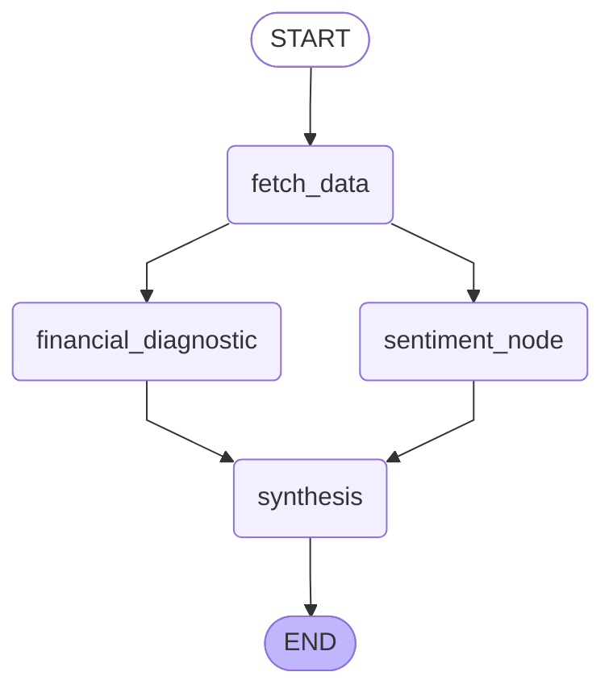

# Analyst in a Box

An autonomous AI equity research engine built with LangGraph and Streamlit. Enter any ticker and the pipeline aggregates SEC 10-K filings, earnings call transcripts, live market news, and quantitative financials — then fuses FinBERT NLP sentiment scoring with LLM Chain-of-Thought synthesis to deliver a rigorous fundamental forecast.

---

## How It Works

### Pipeline Architecture



After `fetch_data` completes, the pipeline branches into two parallel analysis nodes: `financial_diagnostic` (for quantitative analysis) and `sentiment_node` (which uses a high-speed batching technique to score news, SEC filings, and transcripts simultaneously). These two nodes then converge at `synthesis`.

### Node Breakdown

| Node | What it does |
|---|---|
| `fetch_data` | Pulls yfinance financials, DuckDuckGo news, SEC 10-K MD&A via edgartools, and earnings call transcripts via Defeat-Beta API |
| `financial_diagnostic` | Runs a 4-step Chain-of-Thought quantitative analysis on 3-4 years of income, balance sheet, and cash flow data using Groq LLaMA 3.3 70B |
| `sentiment_node` | Consolidates and batches text from market news, SEC MD&A, and earnings transcripts, feeding them to FinBERT in a single pass to calculate individual 		  external, internal, and transcript sentiment scores (-1 to 1).
| `synthesis` | Synthesizes the diagnostic + sentiment scores into a final enterprise forecast using Groq LLaMA 3.3 70B |

---

## Stack

- **Orchestration**: LangGraph
- **LLM**: Groq (LLaMA 3.3 70B)
- **NLP**: FinBERT (ProsusAI/finbert via HuggingFace Transformers)
- **Financial Data**: yfinance, SEC EDGAR (edgartools), Defeat-Beta API
- **News**: DuckDuckGo Search (ddgs)
- **Frontend**: Streamlit

---

## Setup

```bash
pip install -r requirements.txt
streamlit run frontend.py
```

Set your API keys in a `.env` file:

```
GROQ_API_KEY=your_key_here
EDGAR_EMAIL=your_email@example.com
```

---

## Usage

1. Enter any stock ticker (e.g. `AAPL`, `TSLA`, `NVDA`)
2. The pipeline fetches and analyzes data across all four parallel nodes
3. The dashboard displays:
   - **NLP Sentiment** scores for SEC filings, news, and earnings calls
   - **Quantitative Financial Diagnostic** with multi-year trend analysis
   - **Final Enterprise Forecast** synthesized from all signals
   - **Market Reality** — live price and 30-day chart
